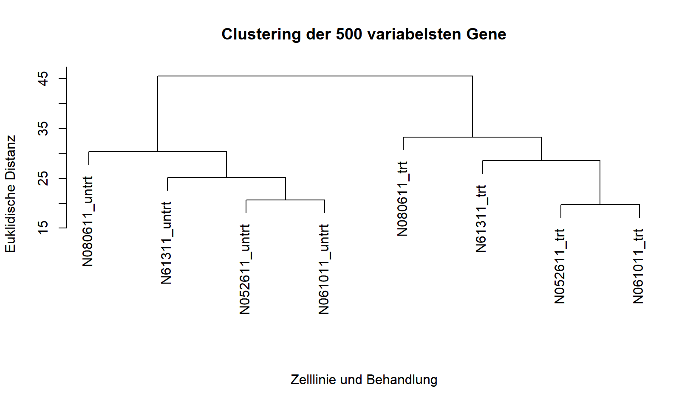
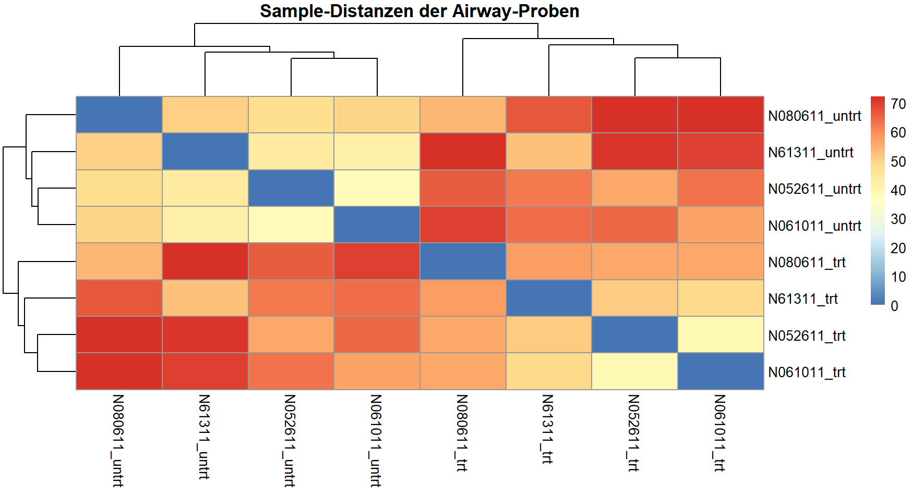

# Clustering

## Fragestellung und Hypothese

Mittels unüberwachtem Clustering wurde untersucht, ob sich die acht Airway-Proben allein anhand ihrer Genexpressionsprofile in biologisch sinnvolle Gruppen einteilen lassen. Im Mittelpunkt stand die Frage, ob die Clusterstruktur eher dem Dexamethason-Behandlungsstatus oder den vier untersuchten Zelllinien entspricht.

Es wurde die Hypothese aufgestellt, dass die Behandlung mit Dexamethason zu systematischen Veränderungen des Genexpressionsprofils führt und sich behandelte und unbehandelte Proben daher auch ohne Verwendung der bekannten Gruppeninformation voneinander trennen lassen.

## Verwendete Daten

Für die Analyse werden folgende Dateien aus dem Ordner `data/` benötigt:

- `VST_transformierte_Daten.csv`
- `Probeninformationen_Normalisierung.csv`

Die Expressionsmatrix enthält 14.224 nach der Qualitätskontrolle verbliebene Gene für acht Proben.

## Erklärung des Codes

### 1. Daten einlesen und vorbereiten

Die VST-transformierten Expressionsdaten und die Probeninformationen werden aus den CSV-Dateien eingelesen. `gene_id` wird als Zeilenname der Expressionsmatrix verwendet. Anschließend werden die Metadaten mit `match()` in dieselbe Reihenfolge wie die Probenspalten der Expressionsmatrix gebracht. `stopifnot()` kontrolliert, ob die Sample-IDs danach exakt übereinstimmen.

Eine zusätzliche z-Standardisierung der Gene wird nicht durchgeführt. Die Expressionswerte liegen bereits VST-transformiert auf einer gemeinsamen Skala vor. Eine genweise Standardisierung würde jedem Gen unabhängig von seiner biologischen Variabilität ein vergleichbares Gewicht geben und damit eine andere Fragestellung untersuchen.

### 2. Euklidische Distanz

Mit `dist()` wird die euklidische Distanz zwischen den acht Proben berechnet. Da `dist()` Distanzen zwischen Zeilen berechnet, wird die Gen-x-Sample-Matrix zuvor mit `t()` transponiert.

### 3. Hierarchisches Clustering

Auf Basis der Distanzmatrix wird mit `hclust()` ein hierarchisches Clustering durchgeführt. Complete Linkage wird als primäre Darstellung verwendet.

Mit `cutree(..., k = 2)` wird das Dendrogramm in zwei Hauptcluster unterteilt. Eine Kreuztabelle mit `table()` vergleicht anschließend die unüberwachte Clusterzuordnung mit dem bekannten Treatment-Label.

### 4. Vergleich der Linkage-Verfahren

Zusätzlich werden die vier in der Lehrveranstaltung behandelten Linkage-Verfahren verglichen:

- Single Linkage
- Average Linkage
- Complete Linkage
- Ward.D2

Die Funktion `is_treatment_separation()` prüft automatisch, ob die zwei resultierenden Cluster vollständig den beiden Treatment-Gruppen entsprechen.

### 5. Feature-Auswahl

Für jedes Gen wird die Varianz über die acht Proben berechnet. Die Gene werden anschließend nach ihrer Varianz sortiert. Für eine zusätzliche Analyse werden die 500 variabelsten Gene verwendet.

Die Feature-Auswahl ist Treatment-unabhängig; die bekannten Gruppenlabels werden nicht zur Auswahl der Gene verwendet.

### 6. Sensitivitätsanalyse

Um den Einfluss der Feature-Anzahl zu untersuchen, wird das Clustering mit den 100, 250, 500, 1.000 und 5.000 variabelsten Genen wiederholt. Für jede Feature-Anzahl wird geprüft, ob die zwei resultierenden Cluster vollständig dem Behandlungsstatus entsprechen.

### 7. Sample-Distance-Heatmap

Die vollständige Distanzmatrix wird mit `pheatmap()` dargestellt. Dadurch können die paarweisen Distanzen zwischen allen acht Proben zusätzlich zur hierarchischen Baumstruktur betrachtet werden.

### 8. k-Means

Als zweiter Clustering-Ansatz wird k-Means mit zwei Clustern durchgeführt. `set.seed(2026)` macht die zufällige Initialisierung reproduzierbar. Mit `nstart = 25` wird das Verfahren aus mehreren Startkonfigurationen ausgeführt.

`k = 2` wird hier gezielt als Robustheitscheck der zuvor beobachteten Zweiteilung verwendet und nicht als vollständig datengetriebene Bestimmung der optimalen Clusterzahl.

### 9. Silhouettenanalyse

Mit `silhouette()` aus dem Paket `cluster` wird bewertet, wie gut die Proben ihrem jeweiligen k-Means-Cluster zugeordnet sind. Positive Silhouettenwerte sprechen für eine passendere Zuordnung zum eigenen Cluster; Werte nahe 1 zeigen eine besonders deutliche Trennung.

Auf eine Elbow-Analyse wird bei nur acht Proben verzichtet. k-Means dient hier als zusätzlicher Robustheitscheck und nicht zur umfassenden Suche nach einer optimalen Clusterzahl.

## Ergebnisse

### Hierarchisches Clustering

Complete Linkage erzeugt zwei Hauptcluster, die vollständig den beiden Behandlungsgruppen entsprechen. Alle vier unbehandelten Proben (`untrt`) liegen in einem Cluster und alle vier mit Dexamethason behandelten Proben (`trt`) im zweiten Cluster.

### Einfluss des Linkage-Verfahrens

| Linkage-Verfahren | Vollständige Treatment-Trennung |
|:---|:---:|
| Single | nein |
| Average | ja |
| Complete | ja |
| Ward.D2 | ja |

Single Linkage reproduziert die Treatment-Trennung nicht. Bei `k = 2` wird die Probe `SRR1039517` separat von den übrigen sieben Proben abgegrenzt. Average, Complete und Ward.D2 ergeben dagegen dieselbe vollständige Trennung nach Behandlungsstatus.

### Einfluss der Feature-Auswahl

Auch bei Beschränkung auf die 500 variabelsten Gene werden behandelte und unbehandelte Proben vollständig voneinander getrennt.

| Anzahl variabler Gene | Vollständige Trennung nach Behandlung |
|---:|:---:|
| 100 | nein |
| 250 | ja |
| 500 | ja |
| 1.000 | ja |
| 5.000 | ja |

Bei nur 100 hochvariablen Genen geht die eindeutige Treatment-Trennung verloren. Ab 250 hochvariablen Genen bleibt sie erhalten.

### Sample-Distanzen

Die Heatmap bestätigt die Treatment-assoziierte Struktur der Daten. Gleichzeitig zeigen sich weiterhin Unterschiede zwischen den einzelnen Zelllinien innerhalb der beiden Behandlungsgruppen.

### k-Means und Silhouette

k-Means mit `k = 2` und `nstart = 25` ordnet die acht Proben vollständig entsprechend ihrem Behandlungsstatus den beiden Clustern zu.

Die mittlere Silhouettenbreite beträgt ungefähr **0,25**. Damit ist die Clusterzuordnung insgesamt positiv, die Trennung jedoch nicht extrem stark. Dies zeigt, dass neben dem Behandlungsstatus weiterhin relevante Variation zwischen den Zelllinien besteht.

## Zusammenfassung

Die Clusteranalyse zeigt eine deutliche Dexamethason-assoziierte Struktur der Expressionsdaten. Complete, Average und Ward.D2 Linkage sowie k-Means mit zwei Clustern trennen behandelte und unbehandelte Proben vollständig. Single Linkage reproduziert diese Struktur dagegen nicht.

Die Treatment-Trennung bleibt bei Verwendung von mindestens 250 hochvariablen Genen stabil, geht bei einer starken Reduktion auf 100 Gene jedoch verloren. Die Silhouettenanalyse zeigt zusätzlich, dass die beiden Treatment-Cluster trotz konsistenter Zuordnung nur moderat voneinander getrennt sind. Insgesamt bleibt somit neben dem Treatment-Effekt eine relevante zelllinienspezifische Variation erhalten.
